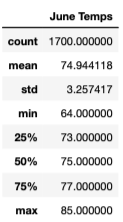
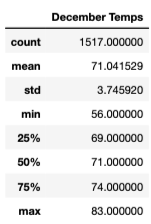

# Surfs Up Analysis

[Link to Challenge Code](https://github.com/c-geisel/Surfs_Up/blob/main/SurfsUp_Challenge.ipynb)

## Overview of the analysis 
The initial purpose of this analysis is to investigate weather patterns on the island of Oahu to decide if it would be profitable to set up a Surf and Shake Shop year-round. In the following analysis summary statistics are found on the months of June and December to determine if this business is sustainable year-round. The analysis is completed using Python and Pandas, with SQLite/SQLAlchemy.

## Results 
- The first task in completing this analysis is to determine the summary statistics for June.
    1. The first step in finding June statistics is to write a query that filters all temperatures out of the month of June from the Measurements table. This is done by starting a query on the date and temperature observations columns in the Measurement table. A filter is then applied that goes through each year included in the table and selects all dates that are greater or equal than the first of June and less than the first of July from the same year.

    '''

        temps_june = session.query(Measurement.date, Measurement.tobs).\
        filter((Measurement.date >= dt.date(2010, 6, 1)) & (Measurement.date < dt.date(2010, 7, 1))|
           (Measurement.date >= dt.date(2011, 6, 1)) & (Measurement.date < dt.date(2011, 7, 1))|
           (Measurement.date >= dt.date(2012, 6, 1)) & (Measurement.date < dt.date(2012, 7, 1))|
           (Measurement.date >= dt.date(2013, 6, 1)) & (Measurement.date < dt.date(2013, 7, 1))|
           (Measurement.date >= dt.date(2014, 6, 1)) & (Measurement.date < dt.date(2014, 7, 1))|
           (Measurement.date >= dt.date(2015, 6, 1)) & (Measurement.date < dt.date(2015, 7, 1))|
           (Measurement.date >= dt.date(2016, 6, 1)) & (Measurement.date < dt.date(2016, 7, 1))|
           (Measurement.date >= dt.date(2017, 6, 1)) & (Measurement.date < dt.date(2017, 7, 1))).all()

    '''
    
    2. Following this the June temperatures are converted into a list. They are converted to a list so that a data frame may be created. A data frame is then created with the column names "Date" and "June Temps". The Date is set as the index, but the index is set to false so that there are not two Date columns in the data frame. 

    3. With the data frame created, summary statistics can be performed on the temperature column by using "df.describe()". The following summary statistics for the temperatures in the month of June are shown:

- The second task in completing this analysis is to determine the summary statistics for December. This step follows the same process as the process for June with a few small changes.
    1. To begin this task, a query is once again written to filter out dates. Instead of filtering months June and July of the same year, a filter is placed in December of a year, and January first on the following year. Also, the last data point in the database is from August 23, 2017. With this being said, no data is filtered from December of 2017 as that is beyond the last data point and thus this query has one less filter than the June temps query. 

    '''

        temps_december = session.query(Measurement.date, Measurement.tobs).\
        filter((Measurement.date >= dt.date(2010, 12, 1)) & (Measurement.date < dt.date(2011, 1, 1))|
           (Measurement.date >= dt.date(2011, 12, 1)) & (Measurement.date < dt.date(2012, 1, 1))|
           (Measurement.date >= dt.date(2012, 12, 1)) & (Measurement.date < dt.date(2013, 1, 1))|
           (Measurement.date >= dt.date(2013, 12, 1)) & (Measurement.date < dt.date(2014, 1, 1))|
           (Measurement.date >= dt.date(2014, 12, 1)) & (Measurement.date < dt.date(2015, 1, 1))|
           (Measurement.date >= dt.date(2015, 12, 1)) & (Measurement.date < dt.date(2016, 1, 1))|
           (Measurement.date >= dt.date(2016, 12, 1)) & (Measurement.date < dt.date(2017, 1, 1))).all()
    '''
    
    2. Following this, the December temperatures are converted into a list and a data frame is then created with the column names "Date" and "December Temps". The Date column is once again set as the index set to false so that there are not two Date columns in the data frame. 

    3. With the data frame created, summary statistics can be performed on the temperature column by using "df.describe()". Notice in the following statistics, that the count is lower than the count for June since there is no data for the year of 2017:

## Summary 
Looking at the results of the June and December summary statistics, June has a higher count since there is also data from the year of 2017. With the given summaries, it can be seen that the months of June and December have relatively similar average temperatures with June being around 75 degrees and December being 71 degrees. Their minimum temperatures are the stats that vary most from each other showing that at its lowest, December will get colder. However, given this information on temperature differences I believe that the differences would not affect the business of a shop year-round. The temperatures are very similar and probably would have no impact on business sustainability year-round. 

To ensure that this conclusion is accurate prior to any investments being made, two more queries could be performed on the months of June and December.
1. First a query could be made very similarly to the one just completed except providing a summary on precipitation data during these two months to see if either month varies in this weather aspect. 
2. Another query that could be performed to provide more insight would be to filter our data to only see information gathered from the most active station. It would be beneficial to view information from the most active station as it would have more reliable data being that it is collected more frequently. The temperature and precipitation queries could then once again be performed using this reliable source of data.
