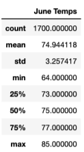
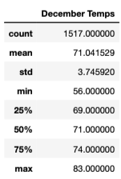

# Surfs Up Analysis

[Link to Challenge Code](https://github.com/c-geisel/Surfs_Up/blob/main/SurfsUp_Challenge.ipynb)

## Overview of the analysis 
Explain the purpose of this analysis.

## Results 
Provide a bulleted list with three major points from the two analysis deliverables. Use images as support where needed.

## Summary 
Provide a high-level summary of the results- write a report that describes the key differences in weather between June and December and two recommendations for further analysis.

